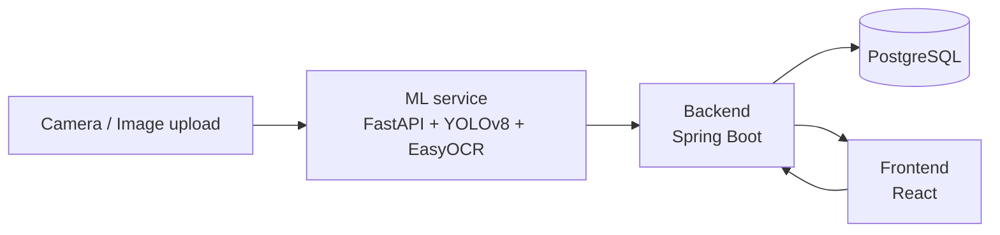

# Automatic Access Control System (ANPR)

A system that automatically recognizes license plates from an image and
decides whether a vehicle is allowed to enter a controlled location (e.g.
a gated community or company parking lot), based on a vehicle whitelist.
Built as an extended follow-up to my bachelor's thesis on automatic
number plate recognition (ANPR).

## How it works



1. An image of the vehicle is sent to the **ML service**, which detects
   the license plate using YOLOv8, crops it, and reads the text with
   EasyOCR.
2. The **backend** receives the result, checks whether the plate is on
   the whitelist, and whether access is currently valid (time window,
   active status).
3. Every attempt (granted or denied) is **logged** to the database for
   audit history.
4. The **frontend** has two screens: a public "gate screen" (camera
   simulation) and a protected admin panel for managing the whitelist.

## Why three separate services

ML inference (Python/PyTorch), business logic and persistence
(Java/Spring), and the user interface (React) are deliberately kept
separate, communicating over a REST API — the same pattern used in real
production systems, where an ML team, a backend team, and a frontend team
can work and deploy independently.

## Tech stack

| Part | Technologies |
|---|---|
| ML service | Python, FastAPI, YOLOv8 (Ultralytics), EasyOCR, OpenCV |
| Backend | Java 21, Spring Boot 3, Spring Security (JWT), Spring Data JPA |
| Database | PostgreSQL |
| Frontend | React, React Router, Axios, Vite |
| Infrastructure | Docker, Docker Compose |

## Getting started

Fastest way — Docker (spins up the ML service, backend, and database with
one command):

```bash
docker-compose up --build
```

Then run the frontend separately:

```bash
cd frontend
npm install
npm run dev
```

Detailed instructions (including running everything manually, step by
step, without Docker) are in each part's own README:
- [`ml-service/README.md`](./ml-service/README.md)
- [`backend/README.md`](./backend/README.md)
- [`frontend/README.md`](./frontend/README.md)

## Project structure

```
anpr-access-control/
├── docker-compose.yml
├── ml-service/          # FastAPI + YOLOv8 + EasyOCR
├── backend/              # Spring Boot + PostgreSQL + JWT
└── frontend/             # React (gate screen + admin panel)
```

## Main API endpoints

| Method | Path | Description | Auth required |
|---|---|---|---|
| POST | `/api/access/check` | Submits an image, returns the access decision | No (called by the "camera") |
| POST | `/api/auth/login` | Admin login, returns a JWT token | No |
| GET/POST/PUT/DELETE | `/api/vehicles` | Manage the vehicle whitelist | Yes (JWT) |
| POST | `/recognize` (ML service) | Detects and reads the plate from an image | - |

## Design notes

- License plates are normalized everywhere (uppercase, no
  spaces/special characters) before comparison — consistently in both
  the ML service and the backend.
- A confidence threshold (`access.control.min-confidence`) prevents
  automatic approval when the ML service is "unsure" about the text it
  read — such cases are flagged as `LOW_CONFIDENCE` for manual review,
  rather than being auto-approved or auto-denied.
- JWT is stateless — the server keeps no session state; the token itself
  carries the user's identity and role.

## Possible extensions

- Support for multiple gates (a `gateId` field already exists in the logs)
- Email/push notification to the owner on each entry
- A statistics dashboard (most frequent attempts, misread rate)
- Deployment to Render/Railway for a live demo

## Author

Built as an extended follow-up to a bachelor's thesis on automatic
license plate recognition (ANPR), with an added backend, database,
authentication, frontend, and Docker infrastructure.
