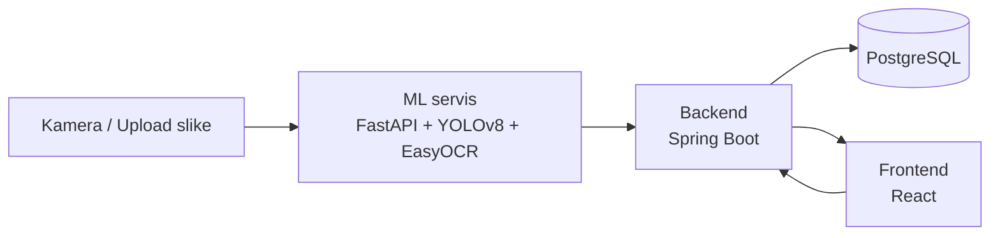

# Sistem za automatsku kontrolu pristupa (ANPR)

Sistem koji automatski prepoznaje registarske tablice sa fotografije i
odlučuje da li vozilo sme da uđe na kontrolisanu lokaciju (npr. gated
community, parking firme), na osnovu whitelist-e vozila. Napravljen kao
prošireni nastavak mog rada iz bachelor teze o prepoznavanju registarskih
tablica (ANPR).

## Kako radi



1. Slika vozila stiže na **ML servis**, koji YOLOv8 modelom detektuje
   tablicu, izdvaja je i EasyOCR-om čita tekst.
2. **Backend** prima rezultat, proverava da li je tablica na whitelist-i i
   da li je pristup trenutno važeći (vremenski prozor, aktivan status).
3. Svaki pokušaj (odobren ili odbijen) se **loguje** u bazu radi istorije.
4. **Frontend** ima dva ekrana: javni "ekran kapije" (simulacija kamere) i
   zaštićen admin panel za upravljanje whitelist-om.

## Zašto tri odvojena servisa

ML inferencija (Python/PyTorch), poslovna logika i baza (Java/Spring), i
korisnički interfejs (React) su namerno odvojeni, komunicirajući preko
REST API-ja — isti obrazac po kom su strukturirani stvarni produkcioni
sistemi, gde ML tim, backend tim i frontend tim mogu da rade i deploy-uju
nezavisno.

## Tehnologije

| Deo | Tehnologije |
|---|---|
| ML servis | Python, FastAPI, YOLOv8 (Ultralytics), EasyOCR, OpenCV |
| Backend | Java 21, Spring Boot 3, Spring Security (JWT), Spring Data JPA |
| Baza | PostgreSQL |
| Frontend | React, React Router, Axios, Vite |
| Infrastruktura | Docker, Docker Compose |

## Pokretanje

Najbrži način — Docker (podiže ML servis, backend i bazu jednom komandom):

```bash
docker-compose up --build
```

Zatim posebno frontend:

```bash
cd frontend
npm install
npm run dev
```

Detaljna uputstva (uključujući ručno pokretanje bez Docker-a, korak po
korak) nalaze se u README fajlu svakog dela:
- [`ml-service/README.md`](./ml-service/README.md)
- [`backend/README.md`](./backend/README.md)
- [`frontend/README.md`](./frontend/README.md)

## Struktura projekta

```
anpr-access-control/
├── docker-compose.yml
├── ml-service/          # FastAPI + YOLOv8 + EasyOCR
├── backend/              # Spring Boot + PostgreSQL + JWT
└── frontend/             # React (ekran kapije + admin panel)
```

## Glavni API endpoint-i

| Metoda | Putanja | Opis | Autentifikacija |
|---|---|---|---|
| POST | `/api/access/check` | Šalje sliku, vraća odluku o pristupu | Nije potrebna (poziva "kamera") |
| POST | `/api/auth/login` | Prijava admina, vraća JWT token | Nije potrebna |
| GET/POST/PUT/DELETE | `/api/vehicles` | Upravljanje whitelist-om vozila | Potreban JWT token |
| POST | `/recognize` (ML servis) | Detekcija i čitanje tablice sa slike | - |

## Napomene o dizajnu

- Tablice se svuda normalizuju (velika slova, bez razmaka/specijalnih
  znakova) pre poređenja — konzistentno i u ML servisu i u backend-u.
- Prag pouzdanosti (`access.control.min-confidence`) sprečava automatsko
  odobravanje kad je ML servis "nesiguran" u pročitani tekst — takvi
  slučajevi se označavaju kao `LOW_CONFIDENCE` za ručnu proveru, ne kao
  automatski `DENIED` ili `GRANTED`.
- JWT je stateless — server ne pamti sesije, token sam nosi identitet i
  ulogu korisnika.

## Moguća proširenja

- Podrška za više kapija (`gateId` polje već postoji u logovima)
- Email/push notifikacija vlasniku pri svakom ulasku
- Dashboard sa statistikom (najčešći pokušaji, procenat pogrešnih čitanja)
- Deploy na Render/Railway za live demo

## Autor

Projekat je napravljen kao prošireni nastavak bachelor rada o automatskom
prepoznavanju registarskih tablica (ANPR), sa dodatim backend-om, bazom,
autentifikacijom, frontend-om i Docker infrastrukturom.
